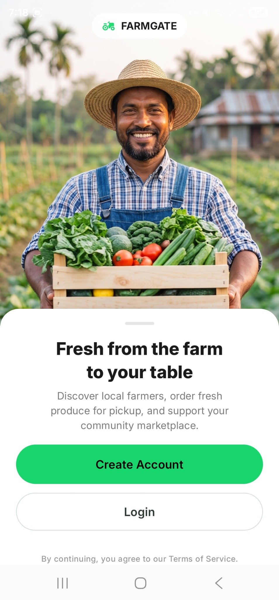
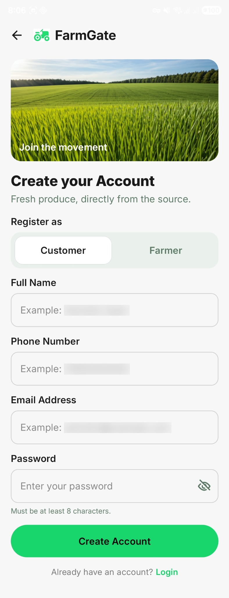
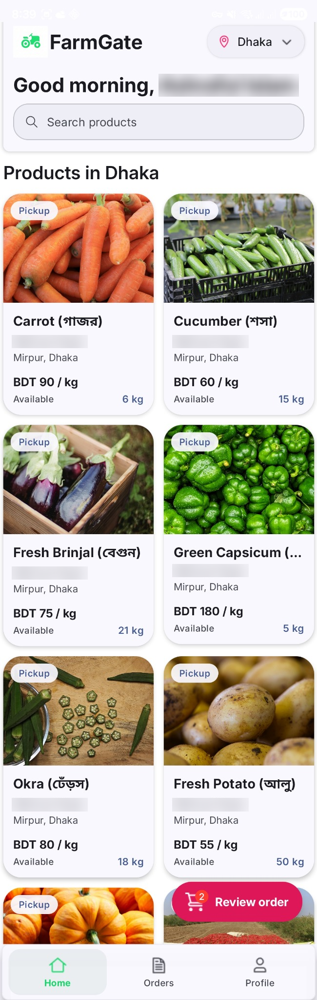
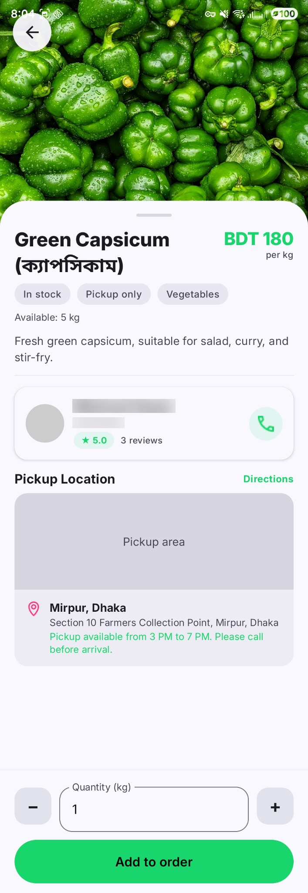
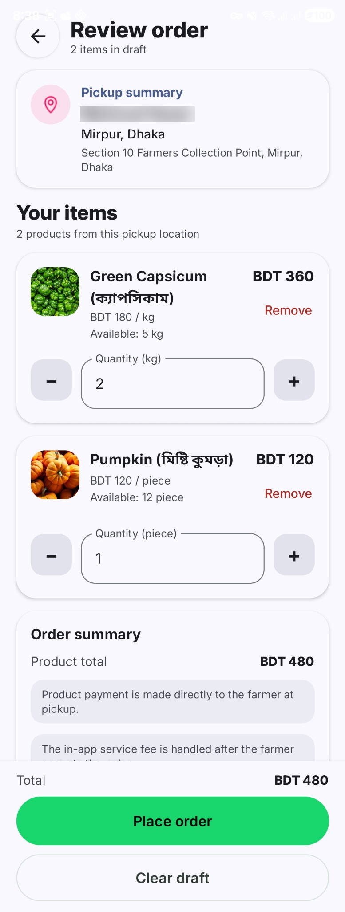

# FarmGate

FarmGate is an Android marketplace application designed to connect local farmers directly with customers through a pickup-based ordering system.

The project was developed as my bachelor’s thesis in Software Engineering at National Research Tomsk State University. This repository contains the Android client. The associated ASP.NET Core backend is available in the [FarmGate Backend repository](https://github.com/Emon-Ashraf/FarmGate-Backend).

## Project Overview

FarmGate allows customers to discover local farmers and products, place pickup orders, and track the order process. Farmers can manage products, pickup locations, stock, and incoming orders. Administrators can review reported issues.

The project uses a pickup-only MVP model. Product payments take place offline during pickup, while the application manages the ordering workflow and platform service-fee confirmation.

## Screenshots

### Customer journey

<p align="center">
  
  
  
</p>

<p align="center">
  
  
</p>

## User Roles

### Customer

- Browse farmers and products by city
- View product information and pickup locations
- Create orders from one farmer and one pickup location
- Confirm the platform service fee
- Track order status
- Complete pickup using a farmer-provided code
- Rate completed orders
- Report order-related issues
- Manage profile information

### Farmer

- Manage products and stock
- Configure pickup locations
- Review incoming orders
- Approve or reject customer orders
- Manage confirmed pickups
- Complete orders using pickup verification
- Review customer-reported issues

### Administrator

- Review submitted issues
- Update issue status
- Monitor marketplace activity through administrative workflows

## Order Workflow

```text
Pending → Awaiting Fee → Confirmed → Completed
```

Rejection and cancellation paths are available when applicable.

Important business rules include:

- Each order belongs to one farmer.
- Each order uses one pickup location.
- Products in an order must belong to the same farmer and pickup location.
- Stock is checked when an order is created.
- Stock is checked again and reserved when the farmer approves the order.
- Product payment happens offline at pickup.
- Order completion uses a farmer-provided pickup code and fulfilled quantities.

## Technology Stack

### Android

- Kotlin
- Jetpack Compose
- Material 3
- Compose Navigation
- ViewModel
- Kotlin Coroutines
- DataStore
- Retrofit
- OkHttp
- Gson
- Coil

### Backend Integration

- REST APIs
- JWT authentication
- ASP.NET Core Web API
- Entity Framework Core
- PostgreSQL

## Project Structure

The Android client is organized into the following main areas:

```text
core/
├── common
├── datastore
├── navigation
└── network

data/
├── model
├── remote
└── repository

presentation/
├── auth
├── customer
├── farmer
├── admin
└── components
```

The application separates UI state, screen logic, repositories, network communication, data-transfer objects, and domain models.

## Requirements

- Android Studio
- JDK 21
- Android SDK 36
- Minimum Android SDK 24
- Running FarmGate backend service

## Getting Started

### 1. Clone the repository

```bash
git clone https://github.com/Emon-Ashraf/FarmGate.git
cd FarmGate
```

### 2. Configure the backend URL

Add the following property to your local `local.properties` file:

```properties
FARMGATE_BASE_URL=http://10.0.2.2:5097/
```

`10.0.2.2` allows an Android emulator to access a backend running on the same computer.

When testing on a physical Android device, replace it with the computer’s local network address and ensure that the device and computer are connected to the same network.

### 3. Start the backend

Follow the setup instructions in the [FarmGate Backend repository](https://github.com/Emon-Ashraf/FarmGate-Backend).

### 4. Build the Android application

On Windows:

```powershell
.\gradlew.bat assembleDebug
```

On macOS or Linux:

```bash
./gradlew assembleDebug
```

### 5. Run the application

Open the project in Android Studio, select an emulator or connected Android device, and run the `app` configuration.

## Project Status

FarmGate is an academic MVP developed as a bachelor’s thesis project. It demonstrates Android application development, REST API integration, role-based workflows, authentication, marketplace business rules, and relational backend integration.

The application is not currently distributed through Google Play and should not be considered a production deployment.

## Author

**Md Ashraful Islam Emon**

Software Engineering Graduate  
Junior Android Developer — Kotlin and Jetpack Compose

- [GitHub](https://github.com/Emon-Ashraf)
